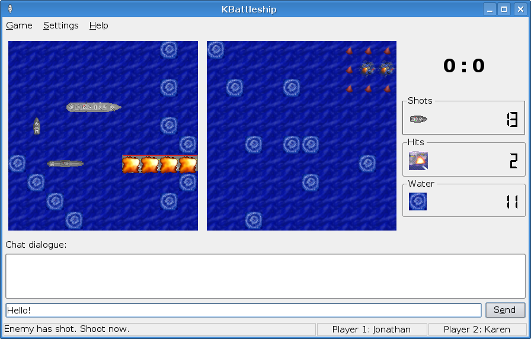

# Bataille Navale : Projet BUT Info 1ère année

Le projet est écrit en Python avec le package _PyGame_.

## Description du projet
[Source Wikipedia](https://fr.wikipedia.org/wiki/Bataille_navale_%28jeu%29)

La **bataille navale**, appelée aussi **touché-coulé**, est un jeu de société dans lequel
deux joueurs doivent placer des ''navires'' sur une grille tenue secrète et tenter de ''toucher'' 
les navires adverses. Le gagnant est celui qui parvient à couler (c'est-à-dire toucher
toutes les cases) tous les navires de l'adversaire avant que tous les siens ne le soient.

## Règles

La bataille navale oppose deux joueurs. Chaque joueur dispose de deux grilles carrées de côté
10, dont les lignes sont numérotées de 1 à 10 et les colonnes de A à J, ainsi que d'une flotte
composée de quelques bateaux d'une à cinq cases de long.

L'une des grilles représente la zone contenant sa propre flotte. Au début du jeu,
chaque joueur place ses bateaux sur sa grille, en s'assurant que ***deux bateaux ne sont 
pas adjacents***. L'autre grille représente la zone adverse, où il cherchera à couler
les bateaux de son adversaire.

Chaque joueur, à son tour, annonce une case (par exemple ''B6''), et son adversaire lui
répond si le tir tombe à l'eau ou au contraire s'il touche un bateau. Dans ce dernier
cas, il annonce ''*touché*'' s'il reste des cases intactes au bateau ciblé, et 
''*touché-coulé*'' sinon.

### Liste des navires
Chaque joueur possède les mêmes navires, dont le nombre et le type dépendent des règles
du jeu choisies.

1. Premier exemple de flotte
   - 1 **Porte-avions** (5 cases)
   - 1 **Cuirassé** (4 cases)
   - 2 **Croiseurs** (3 cases)
   - 1 **Torpilleur** (2 cases)
2. Autre disposition (Belgique)
   - 1 **Cuirassé** (4 cases)
   - 2 **Croiseurs** (3 cases)
   - 3 **Torpilleurs** (2 cases)
   - 4 **Sous-marin** (1 case)

### Exemple d'implémentation graphique

    
